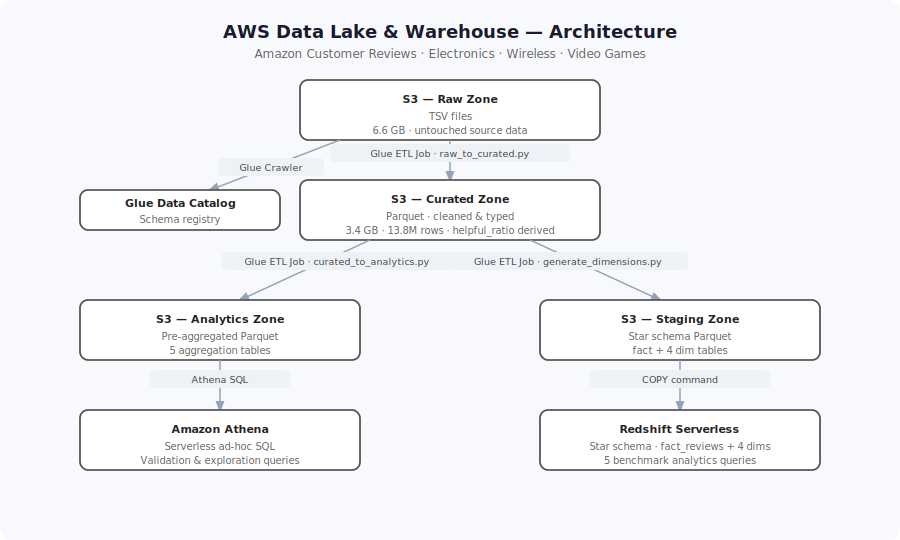
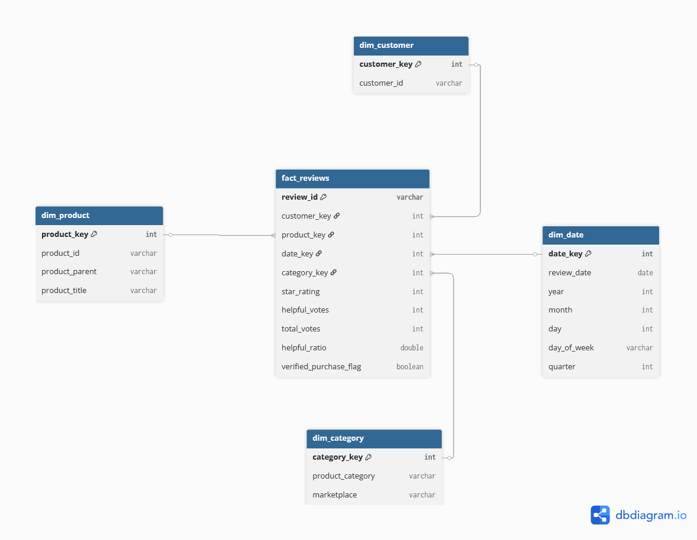

# aws_data_lake_and_warehouse# AWS Data Lake & Warehouse — Amazon Customer Reviews

## Overview

This project implements an end-to-end data lake and warehouse pipeline on AWS, processing **13.8 million Amazon customer reviews** across three product categories: Electronics, Wireless, and Video Games.

Raw TSV files are ingested into S3, cleaned and transformed using PySpark on AWS Glue, and loaded into two analytical layers: a pre-aggregated analytics zone queryable via Athena, and a star schema in Redshift Serverless for structured reporting.

## Architecture



## Technology Used

### Platform
- AWS (us-east-1)

### Services
- Amazon S3
- AWS Glue — schema discovery (Crawlers) and ETL jobs (PySpark)
- AWS Glue Data Catalog
- Amazon Athena
- Amazon Redshift Serverless

### Languages
- PySpark (ETL transformations)
- SQL (DDL, COPY commands, analytics queries)

## Data Used

The [Amazon US Customer Reviews dataset](https://www.kaggle.com/datasets/cynthiarempel/amazon-us-customer-reviews-dataset) is a public dataset containing product reviews from 1995 to 2015. The original AWS public S3 bucket (`s3://amazon-reviews-pds`) is no longer available — files were downloaded from Kaggle and uploaded manually to S3.

This project uses three categories:
- Electronics
- Wireless
- Video Games

## Data Model

The warehouse uses a star schema with one fact table and four dimension tables.



## Setup & Usage

### Prerequisites
- AWS account with IAM user configured (`aws configure`)
- IAM roles for Glue and Redshift (see [`infra/iam_roles.md`](infra/iam_roles.md))
- S3 bucket created in us-east-1

### 1 — Ingest raw data

Download the three TSV files from [Kaggle](https://www.kaggle.com/datasets/cynthiarempel/amazon-us-customer-reviews-dataset) and upload them to your S3 bucket:

```bash
aws s3 cp amazon_reviews_us_Electronics_v1_00.tsv.gz \
  s3://your-bucket/raw/product_category=Electronics/

aws s3 cp amazon_reviews_us_Wireless_v1_00.tsv.gz \
  s3://your-bucket/raw/product_category=Wireless/

aws s3 cp amazon_reviews_us_Video_Games_v1_00.tsv.gz \
  s3://your-bucket/raw/product_category=Video_Games/
```

### 2 — Run Glue ETL jobs

Upload the scripts in `/etl` to your Glue jobs and run them in order:

```
1. raw_to_curated.py          → writes cleaned Parquet to s3://your-bucket/curated/
2. curated_to_analytics.py    → writes aggregations to s3://your-bucket/analytics/
3. generate_dimensions.py     → writes star schema Parquet to s3://your-bucket/staging/redshift/
```

### 3 — Load Redshift

Create the schema and tables using `sql/ddl/create_tables.sql`, then load with:

```bash
# Run in Redshift query editor
# Replace <YOUR_ACCOUNT_ID> and IAM role name before running
sql/curated_to_redshift/load_star_schema.sql
```

### 4 — Run analytics queries

Queries are in `sql/analytics/`. Run them in Redshift or adapt for Athena.

### Query 1 — Rating Trends by Category and Year

```sql
SELECT cat.product_category, d.year,
    ROUND(AVG(f.star_rating::DECIMAL(10,4)), 2) AS avg_rating,
    COUNT(*) AS review_count
FROM reviews.fact_reviews f
JOIN reviews.dim_category cat ON f.category_key = cat.category_key
JOIN reviews.dim_date d ON f.date_key = d.date_key
GROUP BY cat.product_category, d.year
ORDER BY cat.product_category, d.year;
```

- **Electronics** — gradual decline from 3.9 (1999) to a low of 3.53 (2004), then steady recovery to 4.11 by 2015. The dip likely reflects cheap commodity electronics flooding the market in the early 2000s.
- **Video Games** — started strong at 4.13 (1999), dipped to 3.75 (2006) during the DLC and online pass controversy era, then recovered to 4.24 by 2015 — the highest of any category.
- **Wireless** — sharpest drop, from 4.09 (2000) to 3.41 (2004-2005) when early smartphone accessories were poor quality, then slow recovery to 3.99 by 2015.
- **Volume story:** Wireless dominates by 2013-2015 with up to 3M reviews/year vs Electronics at ~800K — the smartphone era is directly visible in this data.

### Query 2 — Helpfulness Analysis per Category

```sql
SELECT cat.product_category,
    ROUND(AVG(f.helpful_ratio::DECIMAL(10,4)), 4) AS avg_helpful_ratio,
    COUNT(*) AS review_count
FROM reviews.fact_reviews f
JOIN reviews.dim_category cat ON f.category_key = cat.category_key
WHERE CAST(f.total_votes AS INTEGER) > 0
GROUP BY cat.product_category
ORDER BY avg_helpful_ratio DESC;
```

- **Electronics reviews are the most helpful** (70%) — people researching expensive tech purchases rely heavily on detailed reviews.
- **Video Games reviews are the least helpful** (56%) — gaming reviews tend to be more opinion-based and polarizing.
- Only ~33% of all reviews ever received a helpfulness vote, meaning the vast majority are never evaluated by other users.

### Query 3 — Verified vs. Unverified Purchases

```sql
SELECT cat.product_category, f.verified_purchase_flag,
    ROUND(AVG(f.star_rating::DECIMAL(10,4)), 2) AS avg_rating,
    COUNT(*) AS review_count
FROM reviews.fact_reviews f
JOIN reviews.dim_category cat ON f.category_key = cat.category_key
GROUP BY cat.product_category, f.verified_purchase_flag
ORDER BY cat.product_category, f.verified_purchase_flag;
```

- Verified purchases rate consistently higher across all 3 categories (+0.34 stars for Electronics, +0.38 for Video Games, +0.06 for Wireless).
- The gap is largest in Video Games — unverified reviews tend to be more negative, possibly from people reviewing games they never bought.
- Wireless has the smallest gap (0.06), suggesting wireless accessory buyers have similar opinions regardless of purchase origin.

### Query 4 — Vine Program Impact

```sql
SELECT cat.product_category, f.vine_flag,
    ROUND(AVG(f.star_rating::DECIMAL(10,4)), 2) AS avg_rating,
    COUNT(*) AS review_count
FROM reviews.fact_reviews f
JOIN reviews.dim_category cat ON f.category_key = cat.category_key
GROUP BY cat.product_category, f.vine_flag
ORDER BY cat.product_category, f.vine_flag;
```

- Vine reviews are marginally higher (+0.09 for Electronics, +0.11 for Wireless, +0.01 for Video Games) — the bias from receiving free products is minimal.
- Vine reviews are a tiny fraction of total volume (18K out of 3M Electronics reviews), so they have negligible impact on overall ratings.
- **Execution time: 202ms** — the fastest query in the set, demonstrating Redshift's columnar storage efficiency on simple aggregations with no date join.

### Query 5 — Product Performance

```sql
SELECT cat.product_category, p.product_id, p.product_title,
    COUNT(*) AS review_count,
    ROUND(AVG(f.star_rating::DECIMAL(10,4)), 2) AS avg_rating
FROM reviews.fact_reviews f
JOIN reviews.dim_category cat ON f.category_key = cat.category_key
JOIN reviews.dim_product p ON f.product_key = p.product_key
GROUP BY cat.product_category, p.product_id, p.product_title
ORDER BY review_count DESC
LIMIT 10;
```

## Future Enhancements

- Add **data freshness checks** and alerting via CloudWatch when the pipeline hasn't run within an expected window
- Introduce **incremental Glue job runs** using job bookmarks to process only new data rather than full reloads
- Add a **BI layer** on top of Redshift using Amazon QuickSight or an open-source alternative
- Extend to additional review categories to demonstrate the pipeline's scalability